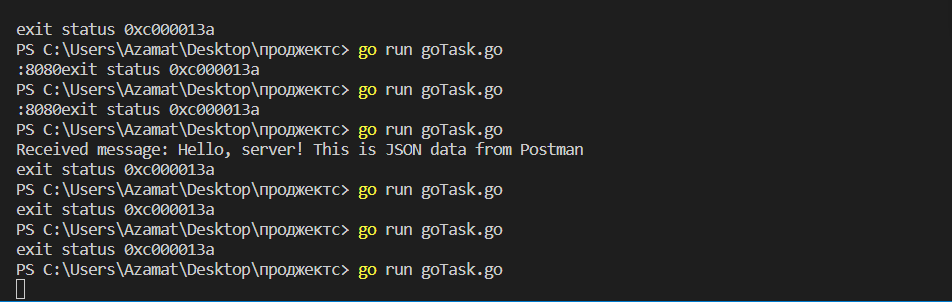
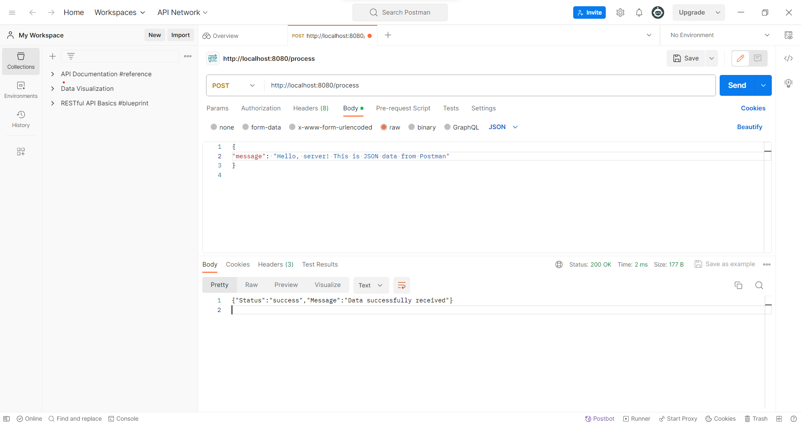

# Go HTTP Server Example

This is a simple Go backend server that handles HTTP POST requests containing JSON data. It checks for a specific field in the JSON data, prints the message to the server console, and sends a JSON response accordingly.

## Screenshots

### Terminal

### Postman

\<Azamat Yerezhepbayev. SE-2216\>
